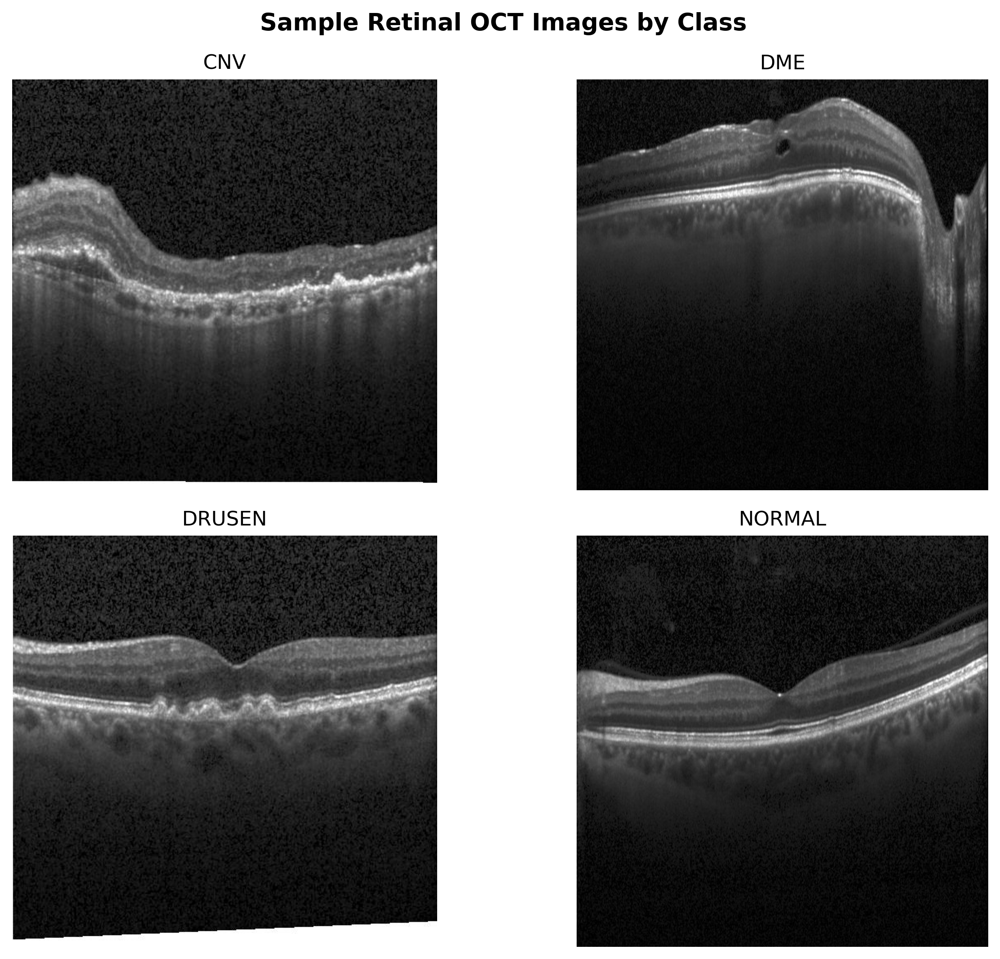

# Retinal OCT Image Classification

This project focuses on classifying retinal Optical Coherence Tomography (OCT) images into four categories using deep learning and transfer learning. The goal is to explore how AI can be used for diagnostic medical image analysis and pattern recognition in healthcare.

## Project Overview

Retinal OCT imaging is commonly used to capture detailed cross-sectional images of the retina. These images can help identify retinal conditions and abnormalities. In this project, I built a deep learning model to classify OCT images into four classes:

- CNV
- DME
- DRUSEN
- NORMAL

The project follows a practical machine learning workflow, including data exploration, image preprocessing, model training, model evaluation, and prediction testing.

## Sample Images from Each Class

Below are representative retinal OCT images from the four classes used in this project.



## Dataset Structure

The dataset is organized into separate training, validation, and testing folders.

```text
data/
├── train_balanced/
│   ├── CNV/
│   ├── DME/
│   ├── DRUSEN/
│   └── NORMAL/
│
├── val_balanced/
│   ├── CNV/
│   ├── DME/
│   ├── DRUSEN/
│   └── NORMAL/
│
└── test_balanced/
    ├── CNV/
    ├── DME/
    ├── DRUSEN/
    └── NORMAL/


Model Architecture

The model uses MobileNetV2 as the base CNN model. MobileNetV2 was pretrained on ImageNet and used as a feature extractor. A custom classification head was added on top for the four OCT classes.

Input Image
   ↓
Data Augmentation
   ↓
MobileNetV2 Pretrained Base
   ↓
Global Average Pooling
   ↓
Dropout
   ↓
Dense Softmax Output Layer
Why Transfer Learning?

Training a CNN from scratch can take a lot of time and data. Transfer learning helps by using a pretrained model that has already learned general image features such as edges, textures, and shapes.

For this project, MobileNetV2 helped reduce training time while still giving strong performance for OCT image classification.

Results

The model achieved around 80% validation accuracy during initial training. The training and validation curves showed improving accuracy and decreasing loss over the epochs.

In this project, I focused not only on overall accuracy but also on class-wise performance, since medical image classification requires understanding which disease categories the model may confuse.

Healthcare Relevance

This project connects directly to diagnostic analytics, image analysis, and pattern recognition in healthcare. It shows how deep learning can be applied to medical imaging data to identify visual patterns and support clinical decision-making workflows.

The goal is not to replace clinicians, but to understand how AI models can assist with image-based screening, prioritization, and decision support.

Repository Structure
Retinal_OCT_Image_Classification/
│
├── assets/
│   └── retinal_oct_samples.png
│
├── data/
│   ├── train_balanced/
│   ├── val_balanced/
│   └── test_balanced/
│
├── models/
│   ├── retinal_oct_mobilenetv2_best.keras
│   └── retinal_oct_mobilenetv2_final.keras
│
├── notebooks/
│   ├── EDA.ipynb
│   ├── Model_Training.ipynb
│   └── Model_Testing.ipynb
│
├── README.md
├── requirements.txt
└── .gitignore
Tools and Libraries Used
Python
TensorFlow / Keras
MobileNetV2
NumPy
Matplotlib
Scikit-learn
PIL
How to Run
Clone the repository
git clone https://github.com/Dilipsingh1234/Retinal_OCT_Image_Classification.git
cd Retinal_OCT_Image_Classification
Install dependencies
pip install -r requirements.txt
Add the dataset locally inside the data/ folder.
Run the notebooks in this order:
1. EDA.ipynb
2. Model_Training.ipynb
3. Model_Testing.ipynb
Note

The dataset and trained model files are not uploaded to GitHub because they are large. They are ignored using .gitignore.

